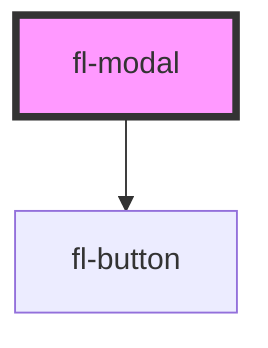

# fl-modal

This is a modal.

<fl-modal header="This is a modal." action="a" actionText="Press Me!" secondary="b" secondaryText="Press Me Too!">
    

        Lorem ipsum dolor sit amet, consectetur adipiscing elit. Orci turpis semper fames diam sollicitudin pellentesque ultricies orci, sit. Eget ut augue venenatis malesuada vulputate faucibus neque pellentesque imperdiet. Mi mauris proin iaculis blandit laoreet eu massa. Pellentesque enim arcu non, ornare tortor, at at. Orci imperdiet aenean cursus enim felis amet.
    

</fl-modal>

<!-- Auto Generated Below -->

## Properties

| Property        | Attribute        | Description                                                                          | Type                      | Default     |
| --------------- | ---------------- | ------------------------------------------------------------------------------------ | ------------------------- | ----------- |
| `action`        | --               | Some functionality attached to the modal aside from closing                          | `(...args: any[]) => any` | `undefined` |
| `actionText`    | `action-text`    | Text to display on the primary button                                                | `string`                  | `undefined` |
| `header`        | `header`         | The title to be displayed in the modal. "Title" creates a conflict.                  | `string`                  | `undefined` |
| `secondary`     | --               | Optional additional functionality attached to the modal                              | `(...args: any[]) => any` | `undefined` |
| `secondaryText` | `secondary-text` | Optional text to display on the secondary button. Recommended if secondary is passed | `string`                  | `undefined` |

## Dependencies

### Depends on

- [fl-button](../button)

### Graph

----------------------------------------------

