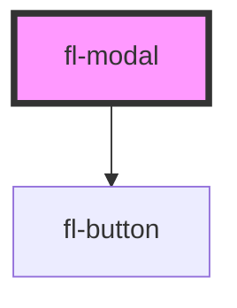

# fl-modal

Click on the button reveal a modal. The button is also independent of the modal component.

Note that when using vanilla HTML, the function type properties need to be attached using JavaScript written `

<fl-button onclick={openModal()}>
  Open Modal
</fl-button>

<fl-modal id="demo-modal" header="This is a modal." action-text="Press Me!" secondary-text="Press Me Too!">
    

        Lorem ipsum dolor sit amet, consectetur adipiscing elit. Orci turpis semper fames diam sollicitudin pellentesque ultricies orci, sit. Eget ut augue venenatis malesuada vulputate faucibus neque pellentesque imperdiet. Mi mauris proin iaculis blandit laoreet eu massa. Pellentesque enim arcu non, ornare tortor, at at. Orci imperdiet aenean cursus enim felis amet.
    

</fl-modal>

<!-- Auto Generated Below -->

## Properties

| Property        | Attribute        | Description                                                                          | Type                      | Default     |
| --------------- | ---------------- | ------------------------------------------------------------------------------------ | ------------------------- | ----------- |
| `action`        | --               | Some functionality attached to the modal aside from closing                          | `(...args: any[]) => any` | `undefined` |
| `actionText`    | `action-text`    | Text to display on the primary button                                                | `string`                  | `undefined` |
| `header`        | `header`         | The title to be displayed in the modal. "Title" creates a conflict.                  | `string`                  | `undefined` |
| `open`          | `open`           | Displays modal if state is true, otherwise no render                                 | `boolean`                 | `false`     |
| `secondary`     | --               | Optional additional functionality attached to the modal                              | `(...args: any[]) => any` | `undefined` |
| `secondaryText` | `secondary-text` | Optional text to display on the secondary button. Recommended if secondary is passed | `string`                  | `undefined` |

## Dependencies

### Depends on

- [fl-button](../button)

### Graph

----------------------------------------------

