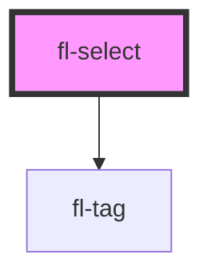

# fl-select

<!-- Auto Generated Below -->

## Properties

| Property         | Attribute          | Description                                                                                                                                                                                    | Type                 | Default |
| ---------------- | ------------------ | ---------------------------------------------------------------------------------------------------------------------------------------------------------------------------------------------- | -------------------- | ------- |
| `clearable`      | `clearable`        | Set to true to add a clear button when the select is populated.                                                                                                                                | `boolean`            | `false` |
| `closeOnSelect`  | `close-on-select`  | Closes dropdown when an item is selected. Only applies when multiple is false.                                                                                                                 | `boolean`            | `true`  |
| `disabled`       | `disabled`         | Set to true to disable the select control.                                                                                                                                                     | `boolean`            | `false` |
| `helpText`       | `help-text`        | The select's help text. Alternatively, you can use the help-text slot.                                                                                                                         | `string`             | `""`    |
| `label`          | `label`            | The select's label. Alternatively, you can use the label slot.                                                                                                                                 | `string`             | `""`    |
| `maxTagsVisible` | `max-tags-visible` | The maximum number of tags to show when `multiple` is true. After the maximum, "+n" will be shown to indicate the number of additional items that are selected. Set to -1 to remove the limit. | `number`             | `3`     |
| `multiple`       | `multiple`         | Set to true to enable multiselect.                                                                                                                                                             | `boolean`            | `false` |
| `name`           | `name`             | The select's name.                                                                                                                                                                             | `string`             | `""`    |
| `open`           | `open`             | Indicates whether or not the dropdown is open. You can use this in lieu of the show/hide methods.                                                                                              | `boolean`            | `false` |
| `placeholder`    | `placeholder`      | The select's placeholder text.                                                                                                                                                                 | `string`             | `""`    |
| `required`       | `required`         | The select's required attribute.                                                                                                                                                               | `boolean`            | `false` |
| `value`          | `value`            | The value of the control. This will be a string or an array depending on `multiple`.                                                                                                           | `string \| string[]` | `""`    |

## Methods

### `hide() => Promise<void>`

Hides the dropdown content

#### Returns

Type: `Promise<void>`

### `reportValidity() => Promise<boolean>`

Checks for validity and shows the browser's validation message if the control is invalid.

#### Returns

Type: `Promise<boolean>`

### `show() => Promise<void>`

Shows the dropdown content

#### Returns

Type: `Promise<void>`

## Shadow Parts

| Part     | Description |
| -------- | ----------- |
| `"tags"` |             |

## Dependencies

### Depends on

- [fl-tag](../tag)

### Graph

----------------------------------------------

*Built with [StencilJS](https://stenciljs.com/)*
