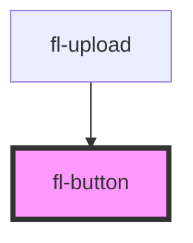

# fl-spinner

This is a spinner

## Examples

<fl-spinner></fl-spinner>
<fl-spinner size='sm'></fl-spinner>
<fl-spinner size='lg'></fl-spinner>

<!-- Auto Generated Below -->

## Properties

| Property   | Attribute  | Description                                        | Type                                                             | Default     |
| ---------- | ---------- | -------------------------------------------------- | ---------------------------------------------------------------- | ----------- |
| `disabled` | `disabled` | Set to true to disable the button.                 | `boolean`                                                        | `false`     |
| `loading`  | `loading`  | Set to true to draw the button in a loading state. | `boolean`                                                        | `false`     |
| `name`     | `name`     | Button name, used in forms                         | `string`                                                         | `undefined` |
| `size`     | `size`     | Button size                                        | `"large" \| "normal"`                                            | `"normal"`  |
| `type`     | `type`     | Button function                                    | `"button" \| "reset" \| "submit"`                                | `undefined` |
| `value`    | `value`    | Button value, used in forms                        | `string`                                                         | `undefined` |
| `variant`  | `variant`  | Button variant                                     | `"danger" \| "primary" \| "secondary" \| "success" \| "warning"` | `"primary"` |

## Shadow Parts

| Part      | Description |
| --------- | ----------- |
| `"icon"`  |             |
| `"label"` |             |

## Dependencies

### Used by

 - [fl-upload](../upload)

### Graph

----------------------------------------------

