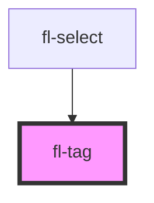

# fl-tag

<!-- Auto Generated Below -->

## Properties

| Property    | Attribute   | Description                            | Type                                                                               | Default     |
| ----------- | ----------- | -------------------------------------- | ---------------------------------------------------------------------------------- | ----------- |
| `clearable` | `clearable` | Set to true to make the tag clearable. | `boolean`                                                                          | `false`     |
| `size`      | `size`      | The tag's size.                        | `"large" \| "medium" \| "small"`                                                   | `'medium'`  |
| `type`      | `type`      | The tag's type.                        | `"danger" \| "default" \| "info" \| "primary" \| "success" \| "text" \| "warning"` | `'default'` |

## Events

| Event   | Description                                 | Type               |
| ------- | ------------------------------------------- | ------------------ |
| `clear` | Emitted when the clear button is activated. | `CustomEvent<any>` |

## Shadow Parts

| Part        | Description |
| ----------- | ----------- |
| `"base"`    |             |
| `"clear"`   |             |
| `"content"` |             |

## Dependencies

### Used by

 - [fl-select](../select)

### Graph

----------------------------------------------

*Built with [StencilJS](https://stenciljs.com/)*
